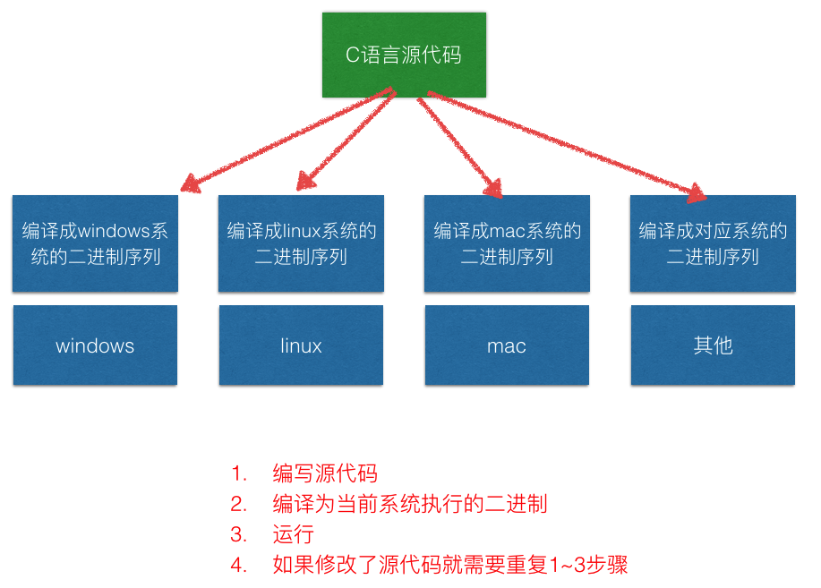
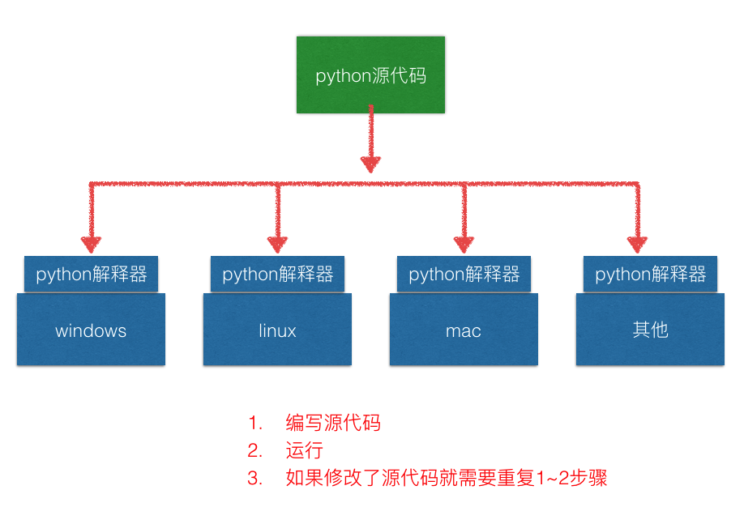

# 程序运行原理

#### 编译型语言（C语言为例）




#### 动态型语言




#### 一个程序是如何运行起来的？比如下面的代码
```python
#othermodule.py
def add(a, b):
    return a + b

#mainrun.py

import othermodule

a = ['itcast', 1, 'python']
a = 'other string'

def func():
    a = 1 
    b = 257 
    print(a + b)

print(a)

if __name__ == '__main__':
    func()
    res = othermodule.add(1, 2)
    print(res)

```

#### 分析


#### dir 函数

Python 的内置函数 dir 可以用来查看一个命名空间下的所有名字符号。一个用处是查看一个命名空间的所有属性和方法（这里的命名空间就是指类、函数、module）。

比如，查看当前的命名空间，可以使用 dir()，查看 sys 模块，可以使用 dir(sys)


#### def 指令

def func()，在字节码指令中就是 MAKE_FUNCTION。
Python 是动态语言，def 实际上是执行一条指令，用来创建函数
（class 则是创建类的指令），而不仅仅是个语法关键字。
函数并不是事先创建好的，而是执行到的时候才创建的。

def func() 将会创建一个名称为 func 的函数对象。
实际上是先创建一个函数对象，然后将 func 这个名称符号绑定到这个函数上。


#### pyc文件

pyc 文件是 PyCodeObject 对象在硬盘上的表现形式。生成pyc文件:

```shell
python -m py_compile xx_module.py
```

pyc文件三大作用

+ 创建时间，py文件比pyc文件新，则从新生成pyc
+ magic num做运行前版本检测，版本不同从新生成pyc
+ PyCodeObject 对象

在运行期间，编译结果也就是 PyCodeObject 对象，只会存在于内存中，而当这个模块的 Python 代码执行完后，就会将编译结果保存到了 pyc 文件中，这样下次就不用编译，直接加载到内存中。

这个 PyCodeObject 对象包含了 Python 源代码中的字符串，常量值，以及通过语法解析后编译生成的字节码指令。PyCodeObject 对象还会存储这些字节码指令与原始代码行号的对应关系，这样当出现异常时，就能指明位于哪一行的代码。


#### import 指令

import 指令是用来载入 module 的，如果需要，也会顺道做编译的事。但 import 指令，还会做一件重要的事情就是把 import 的那个 module 的代码执行一遍，这件事情很重要。
Python 是解释执行的，连函数都是执行的时候才创建的。如果不把那个 module 的代码执行一遍，那么 module 里面的函数都没法创建，更别提去调用这些函数了。

执行代码的另外一个重要作用，就是在这个 module 的命名空间中，创建模块内定义的函数和各种对象的符号名称（也就是变量名），并将其绑定到对象上，这样其他 module 才能通过变量名来引用这些对象。

Python 虚拟机还会将已经 import 过的 module 缓存起来，放到一个全局 module 集合 sys.modules 中。
这样做有一个好处，即如果程序的在另一个地方再次 import 这个模块，Python 虚拟机只需要将全局 module 集合中缓存的那个 module 对象返回即可。

