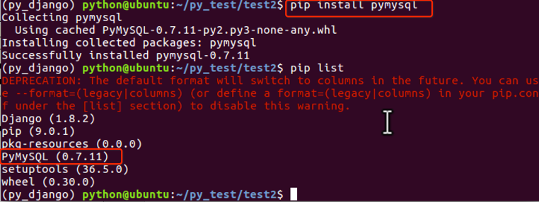
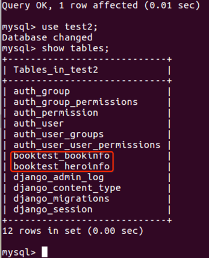
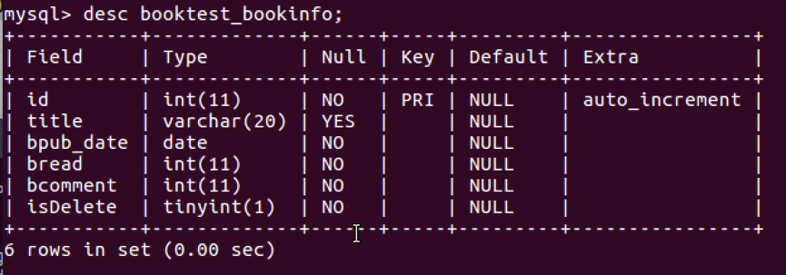
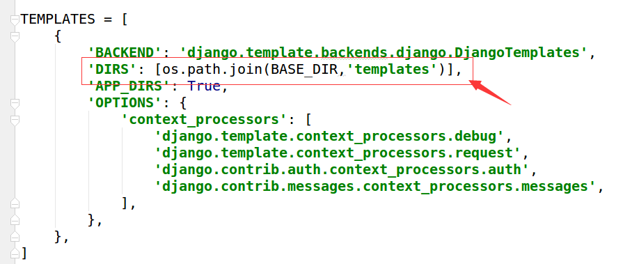
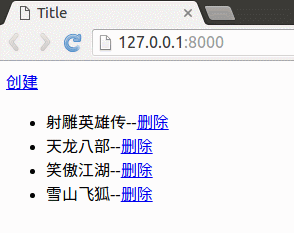

# 定义模型类

* 模型类被定义在"应用/models.py"文件中，此例中为"booktest/models.py"文件。
* 模型类必须继承自Model类，位于包django.db.models中。
* 提示：对于重要数据使用逻辑删除。

# 示例演示
接下来首先以"图书-英雄"管理为例进行演示，复习一下昨天的内容。

#### 1.打开booktest/models.py文件，定义模型类如下

```
from django.db import models

#定义图书模型类BookInfo
class BookInfo(models.Model):
    btitle = models.CharField(max_length=20)#图书名称
    bpub_date = models.DateField()#发布日期
    bread = models.IntegerField(default=0)#阅读量
    bcomment = models.IntegerField(default=0)#评论量
    isDelete = models.BooleanField(default=False)#逻辑删除

#定义英雄模型类HeroInfo
class HeroInfo(models.Model):
    hname = models.CharField(max_length=20)#英雄姓名
    hgender = models.BooleanField(default=True)#英雄性别
    isDelete = models.BooleanField(default=False)#逻辑删除
    hcomment = models.CharField(max_length=200)#英雄描述信息
    hbook = models.ForeignKey('BookInfo')#英雄与图书表的关系为一对多，所以属性定义在英雄模型类中
```

#### 2.迁移

生成迁移文件。

```
python manage.py makemigrations
```

生成迁移文件的时候出现错误，把数据库切换成了mysql，需要安装pymysql模块之后，Django框架才可以操作mysql数据库。安装命令如下：
```
pip install pymysql
```

安装成功之后，在test2/\__init__.py文件中加上如下代码:
```
import pymysql
pymysql.install_as_MySQLdb()
```


然后执行如下命令。

```
python manage.py makemigrations
python manage.py migrate
```


打开数据库的命令行，查看当前所有表如下图：



表bookinfo结构如：
> 默认值并不在数据库层面生效，而是在django创建对象时生效。



表booktest_heroinfo结构如下：
> Django框架会根据关系属性生成一个关系字段，并创建外键约束。


#### 3.测试数据

在数据库命令行中，复制如下语句执行，向booktest_bookinfo表中插入测试数据：

```
insert into booktest_bookinfo(btitle,bpub_date,bread,bcomment,isDelete) values
('射雕英雄传','1980-5-1',12,34,0),
('天龙八部','1986-7-24',36,40,0),
('笑傲江湖','1995-12-24',20,80,0),
('雪山飞狐','1987-11-11',58,24,0);
```

再复制如下语句执行，向booktest_heroinfo表中插入测试数据：

```
insert into booktest_heroinfo(hname,hgender,hbook_id,hcomment,isDelete) values
('郭靖',1,1,'降龙十八掌',0),
('黄蓉',0,1,'打狗棍法',0),
('黄药师',1,1,'弹指神通',0),
('欧阳锋',1,1,'蛤蟆功',0),
('梅超风',0,1,'九阴白骨爪',0),
('乔峰',1,2,'降龙十八掌',0),
('段誉',1,2,'六脉神剑',0),
('虚竹',1,2,'天山六阳掌',0),
('王语嫣',0,2,'神仙姐姐',0),
('令狐冲',1,3,'独孤九剑',0),
('任盈盈',0,3,'弹琴',0),
('岳不群',1,3,'华山剑法',0),
('东方不败',0,3,'葵花宝典',0),
('胡斐',1,4,'胡家刀法',0),
('苗若兰',0,4,'黄衣',0),
('程灵素',0,4,'医术',0),
('袁紫衣',0,4,'六合拳',0);
```

#### 4.定义视图
打开booktest/views.py文件，定义视图代码如下：

```
from django.shortcuts import render,redirect
from booktest.models import *
from datetime import date

#查询所有图书并显示
def index(request):
    list=BookInfo.objects.all()
    return render(request,'booktest/index.html',{'list':list})

#创建新图书
def create(request):
    book=BookInfo()
    book.btitle = '流星蝴蝶剑'
    book.bpub_date = date(1995,12,30)
    book.save()
    #转向到首页
    return redirect('/')

#逻辑删除指定编号的图书
def delete(request,id):
    book=BookInfo.objects.get(id=int(id))
    book.delete()
    #转向到首页
    return redirect('/')
```

#### 5.配置url

打开test2/urls.py文件，配置url如下：

```
from django.conf.urls import include, url
from django.contrib import admin

urlpatterns = [
    url(r'^admin/', include(admin.site.urls)),
    #引入booktest的url配置
    url(r'^',include('booktest.urls')),
]
```

在booktest应用下创建urls.py文件，代码如下：

```
from django.conf.urls import url
from booktest import views

urlpatterns=[
    url(r'^$',views.index),
    url(r'^delete(\d+)/$',views.delete),
    url(r'^create/$',views.create),
]
```

#### 6.创建模板

打开test2/settings.py文件，配置模板查找目录TEMPLATES的DIRS。

```
'DIRS': [os.path.join(BASE_DIR,'templates')],
```



创建templates/booktest/index.html文件。


模板代码如下：

```
<html>
<head>
    <title>复习案例</title>
</head>
<body>
<a href="/create/">创建</a>
<ul>

    <li>{{book.btitle}}--<a href="/delete{{book.id}}/">删除</a></li>

</ul>
</body>
</html>
```

#### 7.运行

运行服务器。

```
python manage.py runserver
```

在浏览器中查看。


操作效果如下图。



在mysql命令行中查看数据表变化如下图：


