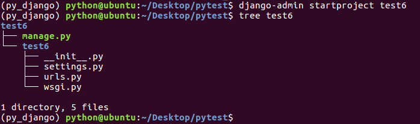
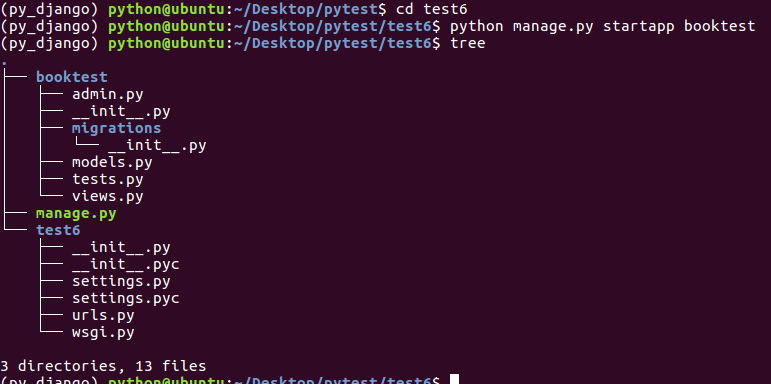
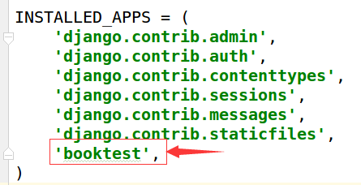
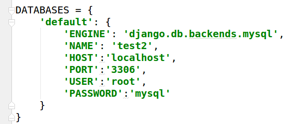
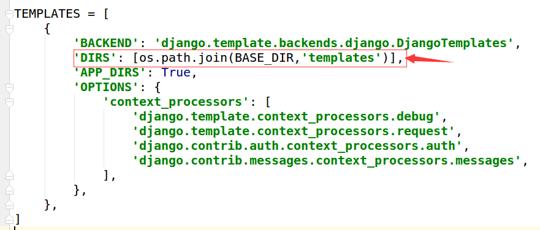
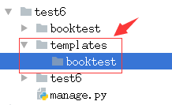
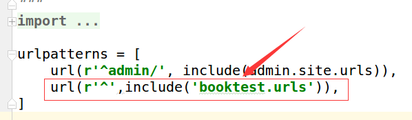
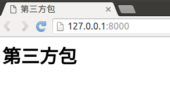

# 第三方

本次课程中主要介绍一些常用的第三方Django模块，包括：
* 富文本编辑器
* 全文检索
* 发送邮件
* celery

# 布署

当项目开发完成后，需要将代码放到服务器上，这个过程称为布署，服务器上需要有一个运行代码的环境，这个环境一般使用uWSGI+Nginx。

#### 创建示例项目

1）在~/Desktop/pytest目录下，进入工作环境py_django。

```
cd ~/Desktop/pytest
workon py_django
```


2）创建项目test6。

```
django-admin startproject test6
```



3）进入项目目录test6，创建应用booktest。

```
cd test6
python manage.py startapp booktest
```



4）在test6/settings.py中INSTALLED_APPS项安装应用。



5）在test6/settings.py中DATABASES项配置使用MySQL数据库test2，数据库在第二部分已经创建。



6）在test6/settings.py中TEMPLATES项配置模板查找路径。



7）创建模板目录结构如下。



8）打开test6/urls.py文件，包含booktest的url配置。



9）在booktest/目录下创建urls.py，配置url。

```
from django.conf.urls import url
from booktest import views
urlpatterns=[
    url(r'^$',views.index),
]
```

10）打开booktest/views.py文件，定义视图index。

```
from django.shortcuts import render

def index(request):
    return render(request,'booktest/index.html')
```

11）在templates/booktest目录下创建文件index.html，代码如下：

```
<html>
<head>
    <title>第三方包</title>
</head>
<body>
<h1>第三方包</h1>
</body>
</html>
```

12）运行服务器。

```
python manage.py runserver
```

13）浏览效果如下图：


