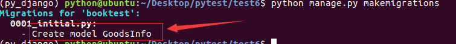
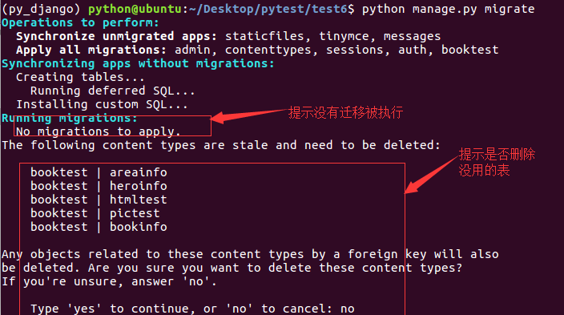
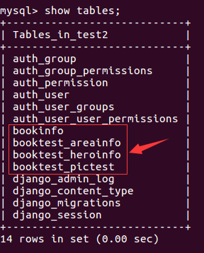
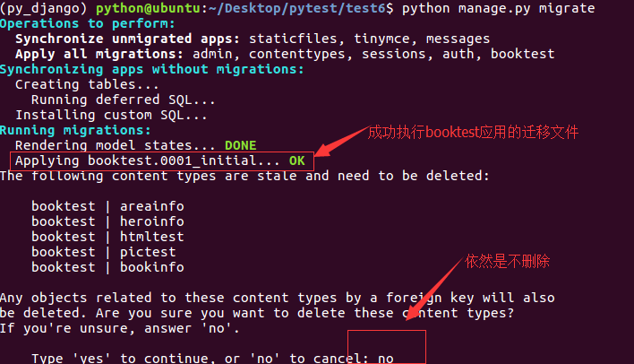
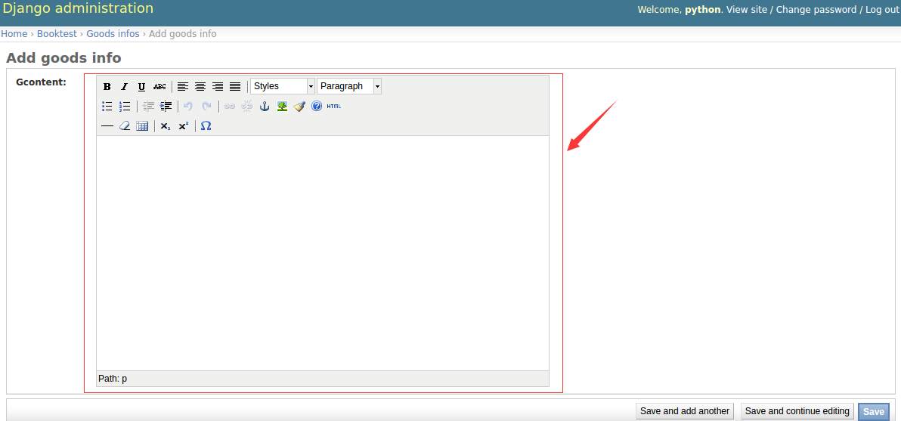

# 在Admin中使用

1）在booktest/models.py中，定义模型的属性为HTMLField()类型。

```
from django.db import models
from tinymce.models import HTMLField

class GoodsInfo(models.Model):
    gcontent=HTMLField()
```

2）生成迁移文件。

```
python manage.py makemigrations
```



3）执行迁移。

```
python manage.py migrate
```

4）在本示例中没有定义其它的模型类，但是数据库中有这些表，提示是否删除，输入no后回车，表示不删除，因为其它的示例中需要使用这些表。



5）迁移完成，新开终端，连接mysql，使用test2数据库，查看表如下：



6）发现并没有表GoodsInfo，解决办法是删除迁移表中关于booktest应用的数据。

```
delete from django_migrations where app='booktest';
```

7）再次执行迁移。

```
python manage.py migrate
```

成功完成迁移，记得不删除no。



8）在booktest/admin.py中注册模型类GoodsInfo

```
from django.contrib import admin
from booktest.models import *
class GoodsInfoAdmin(admin.ModelAdmin):
    list_display = ['id']

admin.site.register(GoodsInfo,GoodsInfoAdmin)
```

9）运行服务器，进入admin后台管理，点击GoodsInfo的添加，效果如下图



在编辑器中编辑内容后保存。
