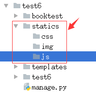
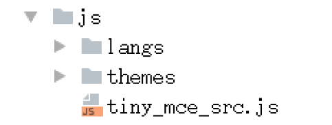
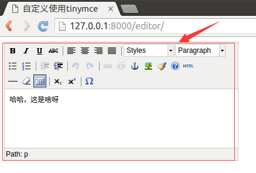

# 自定义使用

1）在booktest/views.py中定义视图editor，用于显示编辑器。

```
def editor(request):
    return render(request, 'booktest/editor.html')
```

2）在booktest/urls.py中配置url。

```
    url(r'^editor/',views.editor),
```

3）在项目目录下创建静态文件目录如下图：



4）打开py_django虚拟环境的目录，找到tinymce的目录。

```
/home/python/.virtualenvs/py_django/lib/python3.5/site-packages/tinymce/static/tiny_mce
```

5）拷贝tiny_mce_src.js文件、langs文件夹以及themes文件夹拷贝到项目目录下的static/js/目录下。



6）在test6/settings.py中配置静态文件查找路径。

```
STATICFILES_DIRS=[
    os.path.join(BASE_DIR,'static'),
]
```

7）在templates/booktest/目录下创建editor.html模板。

```
<html>
<head>
    <title>自定义使用tinymce</title>
    <script type="text/javascript" src='/static/js/tiny_mce.js'></script>
    <script type="text/javascript">
        tinyMCE.init({
            'mode':'textareas',
            'theme':'advanced',
            'width':400,
            'height':100
        });
    </script>
</head>
<body>
<form method="post" action="#">
    <textarea name='gcontent'>哈哈，这是啥呀</textarea>
</form>
</body>
</html>
```

8）运行服务器，在浏览器中输入如下网址：

```
http://127.0.0.1:8000/editor/
```
浏览效果如下图：


