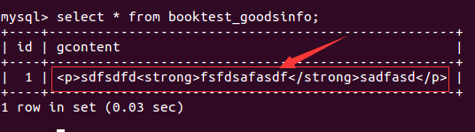
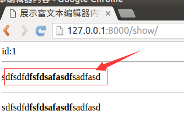

# 显示

通过富文本编辑器产生的字符串是包含html的。
在数据库中查询如下图：



在模板中显示字符串时，默认会进行html转义，如果想正常显示需要关闭转义。

问：在模板中怎么关闭转义
* 方式一：过滤器safe
* 方式二：标签autoescape off

1）在booktest/views.py中定义视图show，用于显示富文本编辑器的内容。

```
from booktest.models import *
...
def show(request):
    goods=GoodsInfo.objects.get(pk=1)
    context={'g':goods}
    return render(request,'booktest/show.html',context)
```

2）在booktest/urls.py中配置url。

```
    url(r'^show/', views.show),
```

3）在templates/booktest/目录下创建show.html模板。

```
<html>
<head>
    <title>展示富文本编辑器内容</title>
</head>
<body>
id:{{g.id}}
<hr>

{{g.gcontent}}

<hr>
{{g.gcontent|safe}}
</body>
</html>
```

4）运行服务器，在浏览器中输入如下网址：

```
http://127.0.0.1:8000/show/
```

浏览效果如下图：


