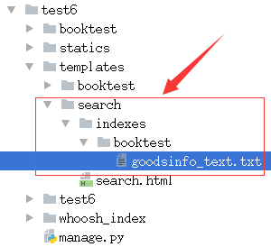
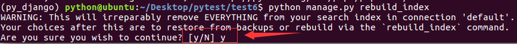
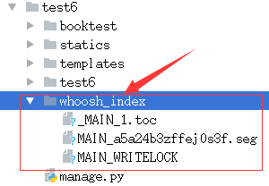

# 创建引擎及索引

1）在booktest目录下创建search_indexes.py文件。

```
from haystack import indexes
from booktest.models import GoodsInfo
#指定对于某个类的某些数据建立索引
class GoodsInfoIndex(indexes.SearchIndex, indexes.Indexable):
    text = indexes.CharField(document=True, use_template=True)

    def get_model(self):
        return GoodsInfo

    def index_queryset(self, using=None):
        return self.get_model().objects.all()
```

2）在templates目录下创建"search/indexes/booktest/"目录。



3）在上面的目录中创建"goodsinfo_text.txt"文件。

```
#指定索引的属性
{{object.gcontent}}
```

4）找到虚拟环境py_django下的haystack目录。

```
/home/python/.virtualenvs/py_django/lib/python3.5/site-packages/haystack/backends/
```

5）在上面的目录中创建ChineseAnalyzer.py文件。

```
import jieba
from whoosh.analysis import Tokenizer, Token

class ChineseTokenizer(Tokenizer):
    def __call__(self, value, positions=False, chars=False,
                 keeporiginal=False, removestops=True,
                 start_pos=0, start_char=0, mode='', **kwargs):
        t = Token(positions, chars, removestops=removestops, mode=mode,
                  **kwargs)
        seglist = jieba.cut(value, cut_all=True)
        for w in seglist:
            t.original = t.text = w
            t.boost = 1.0
            if positions:
                t.pos = start_pos + value.find(w)
            if chars:
                t.startchar = start_char + value.find(w)
                t.endchar = start_char + value.find(w) + len(w)
            yield t

def ChineseAnalyzer():
    return ChineseTokenizer()
```

6）复制whoosh_backend.py文件，改为如下名称：
> 注意：复制出来的文件名，末尾会有一个空格，记得要删除这个空格。

```
whoosh_cn_backend.py
```

7）打开复制出来的新文件，引入中文分析类，内部采用jieba分词。

```
from .ChineseAnalyzer import ChineseAnalyzer
```

8）更改词语分析类。
```
查找
analyzer=StemmingAnalyzer()
改为
analyzer=ChineseAnalyzer()
```

9）初始化索引数据。
```
python manage.py rebuild_index
```

10）按提示输入y后回车，生成索引。



11）索引生成后目录结构如下图：


