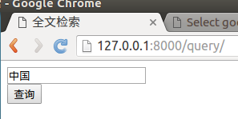
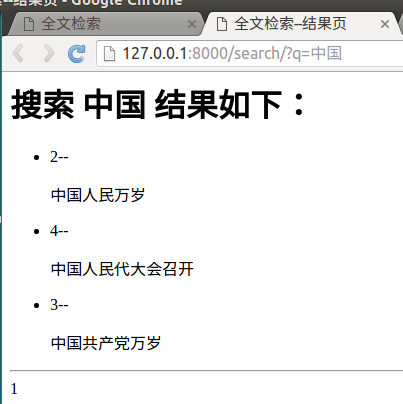

# 使用

按照配置，在admin管理中添加数据后，会自动为数据创建索引，可以直接进行搜索，可以先创建一些测试数据。

1）在booktest/views.py中定义视图query。

```
def query(request):
    return render(request,'booktest/query.html')
```

2）在booktest/urls.py中配置。

```
    url(r'^query/', views.query),
```

3）在templates/booktest/目录中创建模板query.html。
> 参数q表示搜索内容，传递到模板中的数据为query。

```
<html>
<head>
    <title>全文检索</title>
</head>
<body>
<form method='get' action="/search/" target="_blank">
    <input type="text" name="q">
    <br>
    <input type="submit" value="查询">
</form>
</body>
</html>
```

4）自定义搜索结果模板：在templates/search/目录下创建search.html。

搜索结果进行分页，视图向模板中传递的上下文如下：
* query：搜索关键字
* page：当前页的page对象
* paginator：分页paginator对象

视图接收的参数如下：
* 参数q表示搜索内容，传递到模板中的数据为query
* 参数page表示当前页码

```
<html>
<head>
    <title>全文检索--结果页</title>
</head>
<body>
<h1>搜索&nbsp;<b>{{query}}</b>&nbsp;结果如下：</h1>
<ul>

    <li>{{item.object.id}}--{{item.object.gcontent|safe}}</li>

    <li>啥也没找到</li>

</ul>
<hr>

    
        {{pindex}}&nbsp;&nbsp;
    
        <a href="?q={{query}}&amp;page={{pindex}}">{{pindex}}</a>&nbsp;&nbsp;
    

</body>
</html>
```

5）运行服务器，在浏览器中输入如下地址：

```
http://127.0.0.1:8000/query/
```

在文本框中填写要搜索的信息，点击”搜索“按钮。



搜索结果如下：


