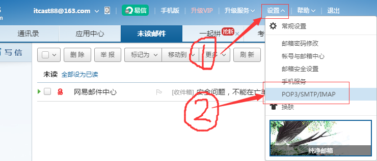
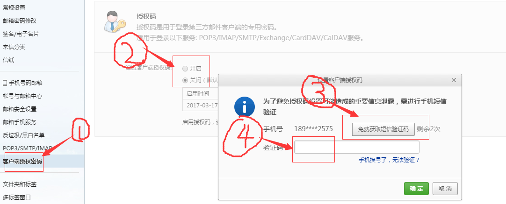
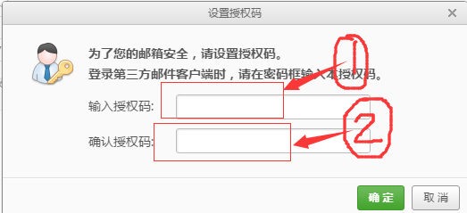
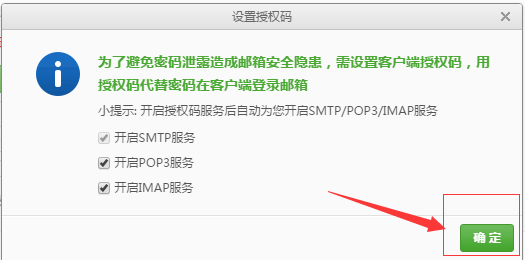
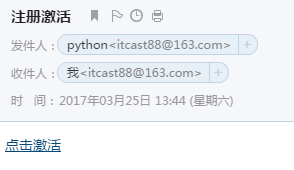

# 发送邮件

Django中内置了邮件发送功能，被定义在django.core.mail模块中。发送邮件需要使用SMTP服务器，常用的免费服务器有：[163](http://help.163.com/09/1223/14/5R7P3QI100753VB8.html)、[126](http://www.126.com/help/client_04.htm)、[QQ](https://kf.qq.com/faq/120322fu63YV130422nqIrqu.html)，下面以163邮件为例。

1）注册163邮箱itcast88，登录后设置。



2）在新页面中点击“客户端授权密码”，勾选“开启”，弹出新窗口填写手机验证码。



3）填写授权码。



4）提示开启成功。



5）打开test6/settings.py文件，点击下图配置。

```
EMAIL_BACKEND = 'django.core.mail.backends.smtp.EmailBackend'
EMAIL_HOST = 'smtp.163.com'
EMAIL_PORT = 25
#发送邮件的邮箱
EMAIL_HOST_USER = 'itcast88@163.com'
#在邮箱中设置的客户端授权密码
EMAIL_HOST_PASSWORD = 'python808'
#收件人看到的发件人
EMAIL_FROM = 'python<itcast88@163.com>'

```

6）在booktest/views.py文件中新建视图send。

```
from django.conf import settings
from django.core.mail import send_mail
from django.http import HttpResponse
...
def send(request):
    msg='<a href="http://www.itcast.cn/subject/pythonzly/index.shtml" target="_blank">点击激活</a>'
    send_mail('注册激活','',settings.EMAIL_FROM,
              ['itcast88@163.com'],
              html_message=msg)
    return HttpResponse('ok')
```

7）在booktest/urls.py文件中配置。

```
    url(r'^send/$',views.send),
```

8）启动服务器，在浏览器中输入如下网址：

```
http://127.0.0.1:8000/send/
```

邮件发送成功后，在邮箱中查看邮件如下图：


