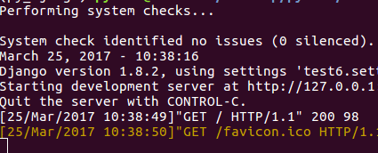
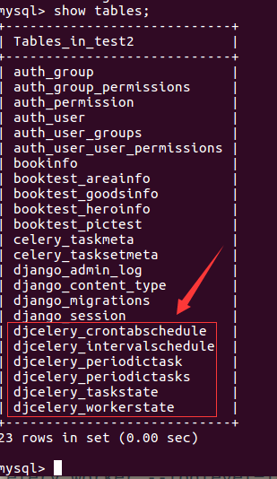
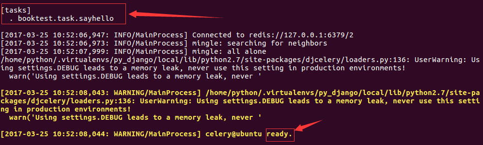
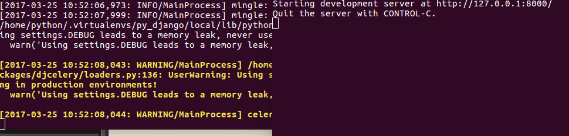
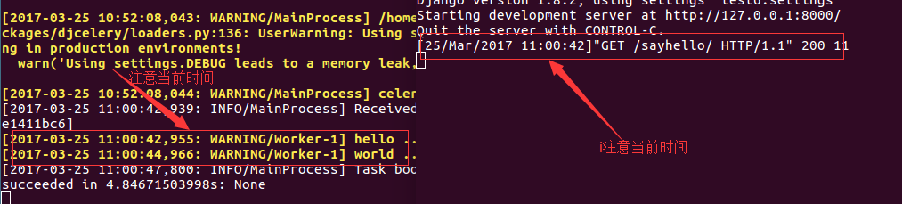

# celery

情景：用户发起request，并等待response返回。在本些views中，可能需要执行一段耗时的程序，那么用户就会等待很长时间，造成不好的用户体验，比如发送邮件、手机验证码等。

使用celery后，情况就不一样了。解决：将耗时的程序放到celery中执行。
* 点击查看[celery官方网站](http://www.celeryproject.org/)
* 点击查看[celery中文文档](http://docs.jinkan.org/docs/celery/)

celery名词：
* 任务task：就是一个Python函数。
* 队列queue：将需要执行的任务加入到队列中。
* 工人worker：在一个新进程中，负责执行队列中的任务。
* 代理人broker：负责调度，在布置环境中使用redis。

安装包：
```
celery==3.1.25
django-celery==3.1.17
```

# 示例
1）在booktest/views.py文件中创建视图sayhello。

```
import time
...
def sayhello(request):
    print('hello ...')
    time.sleep(2)
    print('world ...')
    return HttpResponse("hello world")
```

2）在booktest/urls.py中配置。

```
    url(r'^sayhello$',views.sayhello),
```

3）启动服务器，在浏览器中输入如下网址：

```
http://127.0.0.1:8000/sayhello/
```

4）在终端中效果如下图，两次输出之间等待一段时间才会返回结果。



5）在test6/settings.py中安装。

```
INSTALLED_APPS = (
  ...
  'djcelery',
}
```

6）在test6/settings.py文件中配置代理和任务模块。

```
import djcelery
djcelery.setup_loader()
BROKER_URL = 'redis://127.0.0.1:6379/2'
```

7）在booktest/目录下创建tasks.py文件。

```
import time
from celery import task

@task
def sayhello():
    print('hello ...')
    time.sleep(2)
    print('world ...')
```

8）打开booktest/views.py文件，修改sayhello视图如下：

```
from booktest import tasks
...
def sayhello(request):
    # print('hello ...')
    # time.sleep(2)
    # print('world ...')
    tasks.sayhello.delay()
    return HttpResponse("hello world")
```

9）执行迁移生成celery需要的数据表。

```
python manage.py migrate
```

生成表如下：



10）启动Redis，如果已经启动则不需要启动。

```
sudo service redis start
```

11）启动worker。

```
python manage.py celery worker --loglevel=info
```

启动成功后提示如下图：



11）打开新终端，进入虚拟环境，启动服务器，刷新浏览器。
在旧终端中两个输出间仍有时间间隔。



运行完成后如下图，注意两个终端中的时间，服务器的响应是立即返回的。



12）打开booktest/task.py文件，修改为发送邮件的代码，就可以实现无阻塞发送邮件。

```
from django.conf import settings
from django.core.mail import send_mail
from celery import task

@task
def sayhello():
    msg='<a href="http://www.itcast.cn/subject/pythonzly/index.shtml" target="_blank">点击激活</a>'
    send_mail('注册激活','',settings.EMAIL_FROM,
              ['itcast88@163.com'],
              html_message=msg)
```
