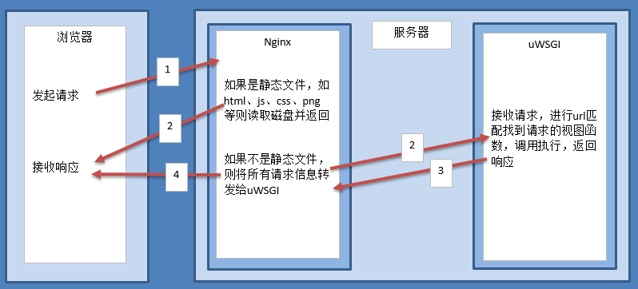
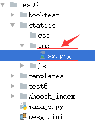
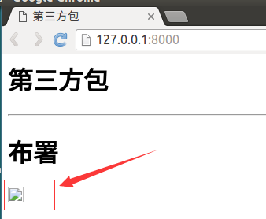

# 布署

当项目开发完成后，需要将项目代码放到服务器上，这个服务器拥有固定的IP，再通过域名绑定，就可以供其它人浏览，对于python web开发，可以使用wsgi、apache服务器，此处以wsgi为例进行布署。

服务器首先是物理上的一台性能高、线路全、运行稳定的机器，分为私有服务器、公有服务器。
* 私有服务器：公司自己购买、自己维护，只布署自己的应用，可供公司内部或外网访问，成本高，需要专业人员维护，适合大公司使用。
* 公有服务器：集成好运营环境，销售空间或主机，供其布署自己的应用，适合初创公司使用，成本低。

常用的公有服务器，如阿里云、青云等，可按流量收费或按时间收费。服务器还需要安装服务器软件，此处需要uWSGI、Nginx。

服务器架构如下图：



# 示例

1）布署前需要关闭调试、允许任何机器访问，打开test6/settings.py文件。

```
DEBUG = False
ALLOW_HOSTS=['*',]
```

2）打开templates/booktest/index.html文件，修改如下：

```
<html>
<head>
    <title>第三方包</title>
</head>
<body>
<h1>第三方包</h1>
<hr>
<h1>布署</h1>

</body>
</html>
```

3）将图片sg.png拷贝到static/img/目录下。



4）运行服务器，在浏览器中输入如下网址：

```
http://127.0.0.1:8000/
```

浏览效果如下图，图片是看不到的。


