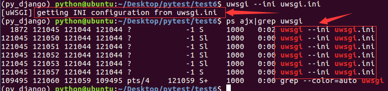
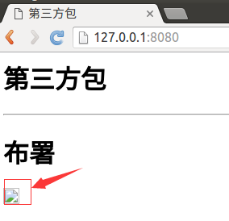
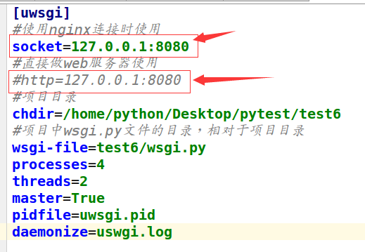

# WSGI

在生产环境中使用WSGI作为python web的服务器。WSGI：全拼为Python Web Server Gateway Interface，Python Web服务器网关接口，是Python应用程序或框架和Web服务器之间的一种接口，被广泛接受。WSGI没有官方的实现, 因为WSGI更像一个协议，只要遵照这些协议，WSGI应用(Application)都可以在任何服务器(Server)上运行。

项目默认会生成一个wsgi.py文件，确定了settings模块、application对象。
* application对象：在Python模块中使用application对象与应用服务器交互。
* settings模块：用于进行项目配置。

# uWSGI

uWSGI实现了WSGI的所有接口，是一个快速、自我修复、开发人员和系统管理员友好的服务器。uWSGI代码完全用C编写，效率高、性能稳定。

1）安装uWSGI。

```
pip install uwsgi
```

2）配置uWSGI，在项目目录下创建uwsgi.ini文件，配置如下：

```
[uwsgi]
#使用nginx连接时使用
#socket=127.0.0.1:8080
#直接做web服务器使用
http=127.0.0.1:8080
#项目目录
chdir=/home/python/Desktop/pytest/test6
#项目中wsgi.py文件的目录，相对于项目目录
wsgi-file=test6/wsgi.py
processes=4
threads=2
master=True
pidfile=uwsgi.pid
daemonize=uwsgi.log
```

3）启动。

```
uwsgi --ini uwsgi.ini
```

4）查看。

```
ps ajx|grep uwsgi
```

效果如下图：



5）停止。

```
uwsgi --stop uwsgi.pid
```

6）在浏览器中输入如下网址：

```
http://127.0.0.1:8080/
```

浏览效果如下图，图片是看不到的。



7）测试没问题，将配置中启用socket，禁用http。



8）停止uwsgi服务，然后再启动uwsgi。
