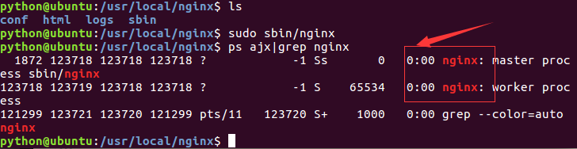
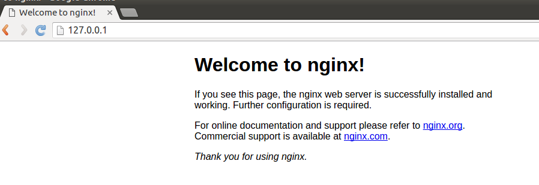
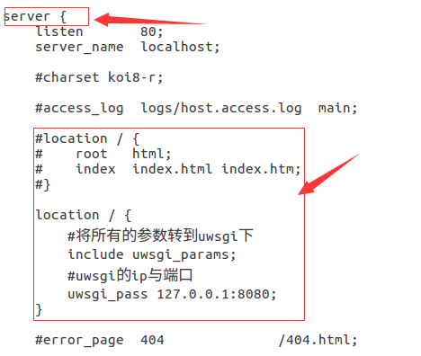
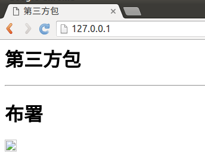
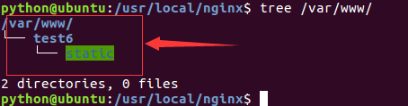
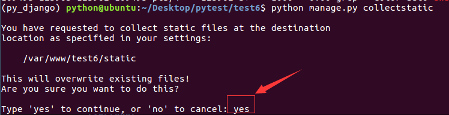

# Nginx

使用nginx的作用主要包括负载均衡、反向代理。
* 点击查看[官方网站](http://nginx.org/)

1）下载nginx后放到桌面上，解压缩。

```
tar zxvf nginx-1.6.3.tar.gz
```

2）进入nginx-1.6.3目录，依次执行以下命令进行安装。

```
./configure
make
sudo make install
```

3）默认安装到/usr/local/nginx/目录，进入此目录。

```
cd /usr/local/nginx/
```

4）启动。

```
sudo sbin/nginx
```

5）查看进程。

```
ps ajx|grep nginx
```



6）停止。

```
sudo sbin/nginx -s stop
```

7）打开浏览器，输入如下网址：

```
http://127.0.0.1/
```

浏览效果如下图：



#### 指向uwsgi项目

1）打开conf/nginx.conf文件。

```
sudo gedit conf/nginx.conf
```

2）在server节点下添加新的location项，指向uwsgi的ip与端口。

```
        location / {
            #将所有的参数转到uwsgi下
            include uwsgi_params;
            #uwsgi的ip与端口
            uwsgi_pass 127.0.0.1:8080;
        }
```

代码效果如下图：



3）关闭nginx后再开启。

4）打开浏览器，刷新后如下图：



#### 静态文件

所有的静态文件都会由nginx处理，不会将请求转到uwsgi。

1）打开conf/nginx.conf文件。

```
sudo gedit conf/nginx.conf
```

2）在server节点下添加新的location项，用于处理静态文件。

```
    location /static {
        alias /var/www/test6/static/;
    }
```

3）在服务器上创建如下目录。

```
sudo mkdir -vp /var/www/test6/static/
```

修改目录权限。

```
sudo chmod 777 /var/www/test6/static/
```

最终目录结构如下图：



4）修改test6/settings.py文件。

```
STATIC_ROOT='/var/www/test6/static/'
STATIC_URL='/static/'
```

5）收集所有静态文件到static_root指定目录。

```
python manage.py collectstatic
```

按提示输入yes，收集文件。



6）停止后再启动nginx服务。

7）在浏览器中刷新，浏览效果如下图：


布署完成。
